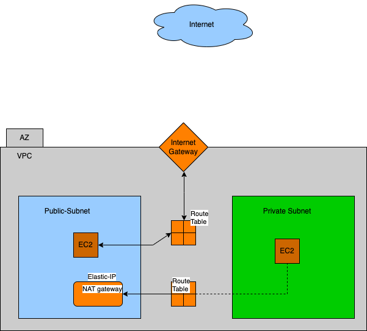

<h1>Architecture</h1>



# AWS VPC Infrastructure Project

This project sets up an AWS Virtual Private Cloud (VPC) architecture using Terraform.

## Running the Terraform Code

To deploy the infrastructure, follow these steps:

1. **Download all the files and Initialize Terraform, in the same directory**
   
   This sets up the Terraform environment and downloads the required provider plugins.
 
   ```bash
   terraform init
   ```
   ```bash
   terraform plan
   ```
   ```bash
   terraform apply
   ```

   You'll also need to provide Access Keys!
   for that use the below command:
   ```bash
   export TF_VAR_aws_access_key=<Your-access-key-here>
   export TF_VAR_aws_secret_key=<Your-secret-key-here>
   ```

   
   
